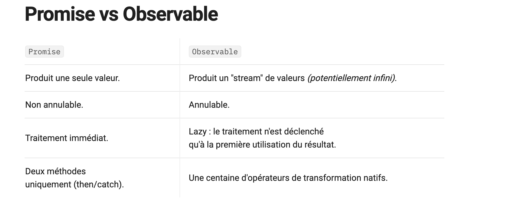

### Programmation synchrone asynchrone
!!! note annotate "Programmation synchrone asynchrone"

    - La programmation asynchrone est une technique qui permet à un programme de démarrer une tâche 
      à l'exécution potentiellement longue et, au lieu d'avoir à attendre la fin de la tâche, 
      de pouvoir continuer à réagir aux autres évènements pendant l'exécution de cette tâche. 
      Une fois la tâche terminée, le programme en reçoit le résultat.

### Javascript
!!! note annotate "Javascript"

    - JavaScript est par défaut un langage synchrone, monothread.
        - ^^Synchrone^^ → Les instructions s’exécutent ligne par ligne, dans l’ordre, et chaque ligne bloque
           la suivante tant qu’elle n’est pas terminée.
        - ^^Monothread^^ → JavaScript utilise un seul fil d’exécution (un seul thread) : 
          il ne peut exécuter qu’une seule tâche à la fois.
       - JavaScript propose trois méthodes de gestion du code asynchrone `Callbacks`, `Promises (es6)`, et `Async/Await (es8)`

    - **Synchrone**: Une requête synchrone bloque le client jusqu'à la fin de l'opération. 
      Dans ce cas, le moteur javascript du navigateur est bloqué
    - **Asynchrone** Une demande asynchrone ne bloque pas le client, 
      c'est-à-dire que le navigateur est réactif.
      À ce moment, l'utilisateur peut également effectuer d'autres opérations. 
      Dans ce cas, le moteur javascript du navigateur n'est pas bloqué.

### Promise vs Observable
!!! note annotate "Promise vs Observable"

    - ^^Une Promise^^ est un objet JavaScript qui représente la succès ou l'échec d'une opération asynchrone. 
      Il s’exécute dès sa création et retourne une seule valeur.
    - ^^Un Observable^^ est un objet JavaScript (RxJS) qui représente un flux de données asynchrones. 
      Contrairement à une Promise, il peut émettre plusieurs valeurs dans le temps, 
      on s’y abonne avec subscribe et on peut se désabonner.

    - ^^RxJS^^ est une bibliothèque pour la programmation réactive qui permet de manipuler 
      des flux de données asynchrones (comme des événements, des requêtes HTTP, ou des timers) 
      de manière déclarative  
      Permet de réagir aux événements et aux données asynchrones de façon fonctionnelle, 
      plutôt que d’utiliser des callbacks ou des promesses dispersées.

    

!!! note annotate "TypeScript"

    - TypeScript est un méta-langage de Javascript qui propose d’ajouter un typage fort aux variables,
      aux fonctions, il propose aussi des fonctionnalités supplémentaire à Javascript comme
      l’annotation et aussi le mécanisme de classe.
    - TypeScript offre une programmation plus orientée objet et un compilateur qui permet de convertir
      le code TypeScript en code Javascript équivalent, interprétable par les navigateurs

### SPA
!!! note annotate "SPA"

    - Une SPA est composé d’une seule page HTML, 
      cette page HTML va contenir suffisamment de code Javascript pour pouvoir 
      faire fonctionner l’ensemble de l’application une fois elle est envoyé par le serveur.
    - Un site web traditionnel : le serveurs reconstruit la page et l’envoi à chaque fois 
      l’utilisateur change d’écrans dans le même site web
    - Une application Web de type SPA, le serveur envoi une seule fois la page web (l’application web)

### 
!!! note annotate "Comment fonctionne Angular en générale ?"

    - Pour démarrer une application, Angular va exécuter les fichier dans l’ordre suivants
        - D’abord Angular va regarder `angular.json` qui va lui rediriger vers 
          le fichier `main`, `main.ts` dans laquelle on va boostraper `le module racine` 
          qui lui même va bootsraper `le composant racine` et le selector 
          de ce composant va être injecté dans le fichier `index.html` qui contient le template de la `SPA`.
        - Module racine qui va tirer les autres 

###
!!! note annotate "MVVM"

    - Architecture: ça signifie **M**odel **V**iew, **V**iew**M**odel Architecture composé de 3 parties 
        - ^^Model^^: La couche qui représente les données et la logique métier d’une application 
          c’est la structure de données (entité) du projet
        - ^^View^^: La couche visuelle de l’application c’est le code d’interface utilisateur 
          donc le Template HTML du composant
        - ^^ViewModel^^: la partie logique du composant: c’est une couche abstraite dans l’application, 
          il fait ^^le lien entre les deux Model et View^^ en poussant les données à jour
          dans la vue via mécanisme (le binding) puis les interaction dans la vue remontent 
          aux composant avec la liaison d’événement 

### Cycle de vie
!!! note annotate "Cycle de vie"

    - Angular fournit des méthodes spécifiques pour mettre en place des traitements lors 
      de la création la mise à jour et la destruction d’un composant.
    - Il est composé de différents phases comme la création, mise à jour de l’affichage et la destruction, 
      il y a plusieurs interfaces qu’on peut l’implémenter dans un composant.
        - La première phase c’est `ngOnChanges`:
            - Intercepter des modification de propriétés qui pourraient survenir
            - Détecter à chaque fois que les valeurs des propriétés coté composant sont changés
        - `ngOnInit`: Assurer que les propriétés d’un composant ont bien été initialisé avec le template,
        - `ngOnDestroy`: appelée en dernier permet de nettoyer proprement le composant lorsqu’il est détruit.
          utilisé généralement pour éviter la fuite du mémoire par rapport au abonnement 
          en se désabonnant sur des évènements asynchrones 

### Constructor vs ngOnInit
!!! note annotate "Constructor vs ngOnInit"

    - `Le constructeur` est utilisé pour configurer l’injection de dépendance 
      qui est relié au système d’injection de dépendance.
    - Le rôle de `ngOnInit` est de définir le comportement du composant à l’initialisation.
    - L'écosystème Angular est un peu particulier, on’est pas dans un pg traditionnelle, 
      Angular est construit autour des composants c’est pour ça son fonctionnement est un peu différent. 

### TODO
!!! note annotate "TODO"
