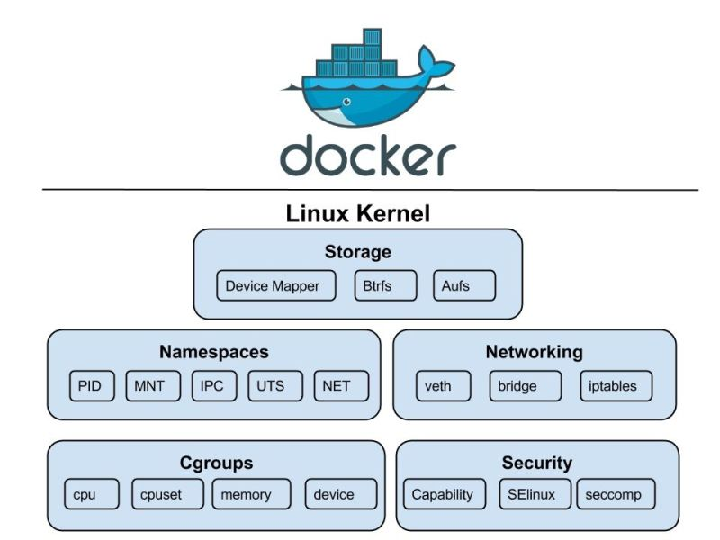

### Git
!!! note annotate "Git qu'est ce que c'est ? :"

    - Git est un logiciel de gestion de versions ^^décentralisée^^.
    - Git s'appuie sur une arborescence de fichiers et permet de stocker et de connaître l'intégralité de la chronologie et des modifications (ajout, suppression, modification) qui lui on été apportées.
    - Le ^^concept de décentralisation^^ sert principalement à permettre à des membres d'une même équipe 
      à travailler de manière désynchronisée des autres et éviter d'écraser les modifications des autres 
      lors d'un accès concurrentiel à un fichier. 
        - Avec Git, chacun clone le dépôt en local sur son poste, puis n'envoie au serveur que ses modifications après avoir récupéré et fusionné les modifications des autres.
        - Git surveille l'arborescence des fichiers et stock en mémoire une copie binaire de chaque fichier à chaque étape chronologique.
    - Git permet une grande flexibilité dans la manière dont les développeurs collaborent sur un projet

### Docker 🐳
!!! note annotate "Docker"

    - Déf 1: ^^Une plateforme^^ qui permet de créer, déployer et exécuter des applications dans des conteneurs isolés.
    - Déf 2: Docker est un ensemble de produits PaaS qui utilisent la virtualisation au niveau du système d'exploitation 
      pour fournir des logiciels dans des packages appelés conteneurs.
        - Les conteneurs sont isolés les uns des autres et regroupent leurs propres logiciels, bibliothèques et fichiers de configuration.
        - Ils peuvent communiquer entre eux via des canaux bien définis.
        - Tous les conteneurs sont {++exécutés par un seul noyau de système d'exploitation++}
          et utilisent donc moins de ressources qu'une machine virtuelle.

    !!! info annotate "Dockerfile"
    
        - Il contient ==les instructions de construction d’une image== (base image, dépendances, fichiers copiés, ports exposés, etc.)
        - Il est ==le code source d'une image Docker==.
        - Il se compose d'instructions définies pour créer une image Docker.

    !!! info annotate "Un conteneur"

        - C’est ==une instance en cours d’exécution d’une image== [ le modèle cad l’image devient un processus actif ] 
          c’est ==comme une petite boîte== qui contient tout ce qu’il faut pour faire tourner une application (code, dépendances, configurations…).
        - L’image c’est la recette et le conteneur c’est le plat préparé à partir de cette recette.

    !!! info annotate "Une image"
    
        - C'est ==un modele== qui contient tout ce qui est nécessaire pour exécuter une application: code, runtime, outils système, 
           bibliothèques système et paramètres.
        - C’est un modele qui représente un ^^logiciel^^ léger, autonome et ^^exécutable^^ : les images deviennent 
          des conteneurs au moment de ^^l'exécution^^
        - L’image docker permet de créer des conteneurs docker qui sont faciles à transporter d'une plateforme à une autre.
        - Les instructions données dans le fichier Dockerfile sont appelées ^^couches^^ dans l'image Docker: 
          donc l’image Docker se compose de plusieurs couches en fonction du nombre d'instructions que nous avons données.

    !!! info annotate "Différence entre un conteneur et une machine virtuelle"
    
        - Une VM ==virtualise le système d’exploitation complet==, alors qu’un conteneur 
          ==partage le même noyau du système== et ne contient que les dépendances nécessaires à l’application 
        - → plus léger et plus rapide.
        - ^^Isolation légère^^ : Isolation moins complète, mais suffisante pour les apps
            - Le conteneur est isolé pour ses processus, son système de fichiers, et son réseau virtuel,
              mais ^^tout accès au matériel passe par le noyau du système.^^

##### 🐳 [Devops|Docker]

Les foundations existent déjà bien avant :
1. 𝐍𝐚𝐦𝐞𝐬𝐩𝐚𝐜𝐞𝐬 (PID, NET, MNT, UTS, IPC) pour isoler les processus 
2. 𝐂𝐠𝐫𝐨𝐮𝐩𝐬 pour contrôler CPU, RAM et I/O 
3. 𝐂𝐡𝐫𝐨𝐨𝐭 + 𝐨𝐯𝐞𝐫𝐥𝐚𝐲 filesystems pour gérer le système de fichiers

Aujourd'hui, que ce soit 𝐜𝐨𝐧𝐭𝐚𝐢𝐧𝐞𝐫𝐝, 𝐫𝐮𝐧𝐜, 𝐏𝐨𝐝𝐦𝐚𝐧 𝐨𝐮 𝐊𝐮𝐛𝐞𝐫𝐧𝐞𝐭𝐞𝐬, tous utilisent exactement les mêmes primitives Linux.

---

### Docker Questions
!!! note annotate ""

    1. Quelle différence entre COPY et ADD dans un Dockerfile ?
        - COPY copie simplement des fichiers locaux.
        - ADD peut aussi extraire des archives et il peut télécharger des fichiers depuis une URL Souvent, on préfère COPY (plus prévisible).
    2. Qu’est-ce que docker-compose ?
        - Un outil qui permet de définir et gérer plusieurs conteneurs comme un seul service, via un fichier docker-compose.yml.
    3. Différence entre ENTRYPOINT et CMD ?
        - ENTRYPOINT définit le processus principal du conteneur.
        - CMD fournit les arguments par défaut (peut être écrasé).
    4. Qu’est-ce qu’un multi-stage build ?
        - Technique pour réduire la taille des images Docker en utilisant plusieurs étapes dans un même Dockerfile :
    5. Qu’est-ce qu’un réseau Docker ?
        - Un mécanisme qui permet aux conteneurs de communiquer entre eux et avec l’extérieur, Tout en restant isolés selon le type de réseau choisi.
        - Docker crée par défaut un réseau bridge. On peut aussi créer des réseaux personnalisés pour permettre la communication entre conteneurs :
    6. Qu’est-ce qu’un registry ?
        - Un registre Docker (comme Docker Hub, GitLab Registry ou Amazon ECR) est un dépôt où sont stockées les images.

### Kubernetes
!!! note annotate ""

    1. TODO 
