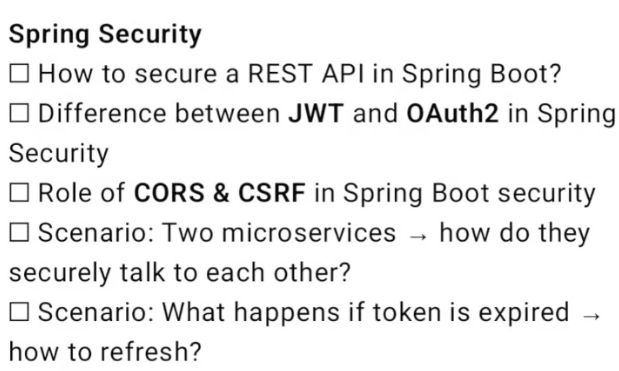

#### Layers & Design Patterns

[//]: # (!!! note inline annotate "java questions")

[//]: # (    ![img.png]&#40;assets/images/java-q.png&#41;)
[//]: # (    ![img.png]&#40;https://pbs.twimg.com/media/G2WcAfxaoAA6lXX?format=jpg&name=large&#41;)

!!! note annotate "Layers & Design Patterns"

    1. Différence entre DTO, DAO, Repository, Entity et Service 
         - **Entity**
            - C’est l’objet métier qui représente une table en base de données. 
            - Chaque instance = une ligne en base.
            - Contient les données persistées.
         - **DTO** (Data Transfer Object)
            - Objet utilisé pour transférer des données entre les couches (souvent API ↔ backend).
         - **DAO** (Data Access Object)
            - Couche d’accès aux données: Permet d’isoler le code SQL dans une classe dédiée
            - Ancien pattern remplacé par Repository dans Spring.
            - Aujourd’hui : Les Repositories Spring Data remplissent ce rôle.
         -  **Repository** (Spring Data)
            - Interface utilisée pour accéder à la base, Automatiquement implémentées par Spring.
            - Exemples : CrudRepository, JpaRepository
         - **Service**
            - Couche métier où se trouve la logique métier de l’application
    
       2. Pourquoi les DTO sont-ils importants dans les API REST ? 
           - Son role est clairement de séparer l’API de la base de données
               - **Adapter** les données aux besoins du client
               - Le DTO permet de contrôler exactement quelles données sont exposées (Sécuriser l’application)
           - Sécuriser l’application
               - On peut exclure les champs sensibles (mot de passe, token, internalId…)
           - Faciliter la maintenance et l’évolution
               - Si la structure de la base change, l’API peut rester **stable** grâce aux DTO.
               
       3. Différence entre Repository et DAO (abstraction Spring Data vs couche DAO personnalisée)
           - DAO: 
               - Classe concrète (personalisée) qui contient le code des requêtes SQL
               - Legacy, projets sans Spring Data
           - Repository
               - _Interface abstraite_ pour l’accès aux données, `Spring Data` fournit l’implémentation
               - Projets modernes Spring Boot
       4. Où utiliser @Transactional (couche DAO vs couche Service) ? 
           - Annotation Spring pour gérer les transactions automatiquement. 
           - [ ] Sur la couche DAO ?
               - Possible mais pas recommandé
               - Difficile de gérer des scénarios métier qui impliquent plusieurs DAO
               - Comportement non cohérent si le service appelle plusieurs DAO
           - [x] Sur la couche Service ?
               - Permet de regrouper plusieurs appels DAO dans une seule transaction.
           - Règles / Bonnes pratiques
               - Toujours mettre @Transactional sur la couche Service,
               - DAO/Repository doit rester simple et "stateless", sans logique métier
               - Spring gère le rollback automatiquement pour les exceptions runtime.
               
       5. Scénario : Que se passe-t-il si une transaction est placée dans le contrôleur ?
           - Pourquoi ce n’est pas recommandé
               - Couche de présentation 
                   - Le contrôleur doit être ==responsable de _recevoir_ la requête et de _renvoyer_ la réponse.== 
                   - Ajouter la `transaction` **mélange** la _logique métier_ et _la présentation._
               - Risque d’exposer la transaction trop tôt
                   - La transaction reste ouverte plus longtemps,
                     si le contrôleur fait beaucoup de traitements ou appelle plusieurs services
               - Difficulté de test / maintenance
                   - La logique métier doit rester dans le Service.
                   - Tester le contrôleur devient compliqué si des transactions sont là.

[//]: # (!!! note annotate "Layers & Design Patterns")

[//]: # ()
[//]: # (    ![img.png]&#40;https://pbs.twimg.com/media/G3I1RNEa0AAkUTL?format=jpg&name=medium&#41;)


#### Database & persistence:

[//]: # (![img.png]&#40;https://pbs.twimg.com/media/G2MJf4AaIAQkEOa?format=jpg&name=medium&#41;)

!!! note annotate ""
    
    1. Comment Spring Boot s'intègre avec JPA/Hibernate ?
        - Spring Boot simplifie la configuration et l’utilisation de `JPA/Hibernate` grâce à ==l’auto-configuration==.
        - Dans Spring, `EntityManager` est souvent encapsulé dans un `JpaRepository`.
        - Auto-configuration
            - Spring Boot configure automatiquement :
                - Crée le _`DataSource`_, l’_`EntityManagerFactory`_ et le _`TransactionManager`_.
                - _DataSource_ (Crée automatiquement une source de données)
                - _EntityManagerFactory_ (Interaction avec les Entities.)
                - _PlatformTransactionManager_ (Gère automatiquement les transactions (@Transactional)
                - _JpaRepository_ (Interface pour l’accès aux données)
                - [x] Résultat : Persistance des objets Java vers la base de données avec minimum de configuration.
    
       2. Chargement Lazy vs Eager : pièges dans JPA
           - LazyInitializationException
               -  Problème typique : on accède à une collection lazy **hors de la transaction** ou **session Hibernate**.
               ```java 
               User user = userRepository.findById(1L).orElseThrow();
               session.close(); // ou fin de @Transactional
               user.getOrders(); // LazyInitializationException !
               ```
               - Cause : Hibernate n’a plus de session pour charger la collection.
               - Solution
                   - Utiliser `JOIN FETCH` dans la requête JPQL.
                   - Ou transformer en DTO (projection) et récupérer les données `avant de quitter la transaction`.
           - Bonnes pratiques
               - Ne jamais accéder à une collection lazy hors transaction
               - Utiliser DTO ou JOIN FETCH pour charger uniquement ce qui est nécessaire
               - Éviter Eager sur collections larges (OneToMany ou ManyToMany)
           -
       3. Comment Spring Boot gère les transactions et les rollbacks ?
           - Spring Boot gère les transactions grâce à l’annotation @Transactional, fournie par Spring. 
              Quand une méthode annotée est appelée, Spring ouvre une transaction, exécute la logique, 
              puis fait un commit ou un rollback automatiquement.
              - Rollback automatique sur les RuntimeException
              - Pas de rollback sur les exceptions checked, sauf si on précise rollbackFor.
              - Spring gère aussi la propagation (REQUIRED, REQUIRES_NEW…) et l’isolation.
       4. Pool de connexions par défaut dans Spring Boot (HikariCP) et optimisation
       5. Scénario : Comment prévenir les requêtes N+1 dans Spring Data JPA ?
       6. Scénario : Comment implémenter le multi-tenancy dans Spring Boot ?
           - Le multi-tenancy, c’est le fait qu’une seule application serve plusieurs clients tout en isolant leurs données.
           - Spring Boot gère le multi-tenancy via Hibernate.
           - On récupère l’identifiant du tenant (client) à chaque requête, on le stocke dans un contexte, 
              puis Hibernate choisit la DB/Schema.


!!! note annotate "DataSource"

    - DataSource = objet Java qui représente _une source de données_, typiquement une base de données.
    - Fournit :
        - Une connexion JDBC à la base 
        - La gestion du pool de connexions
    - _Spring Boot_ utilise `DataSource` pour :
        - Fournir les connexions à la base à Hibernate/JPA.

!!! note annotate "EntityManager"

    - **EntityManager**, objets JPA permet d’interagir avec la base de données (pour interagir avec les Entities)
    - ---
    - Le **`DataSource`** ==fournit les connexions JDBC à la base de données==, 
      alors que l’**`EntityManager`** est l’==API JPA/Hibernate== qui _permet de manipuler les Entities_ 
      et exécuter des opérations CRUD dans un contexte de persistance. DataSource est bas niveau, EntityManager est haut niveau orienté objet.


___

___

___


!!! note annotate ""

    

!!! note annotate ""

    

!!! note annotate ""

    

#### Most asked DB persistence questions in Springboot :


!!! note annotate ""

     
!!! note annotate ""

    - 

!!! note annotate ""

    - 

##### Spring security
!!! note annotate ""

    - 

!!! note annotate ""

    - 
    1. equals(Object obj)→checks if two objects have the same references but we often override for custom comparison
    2. hashCode()→ generates an integer hash value for the object, crucial for using it in hash-based collections like HashMap.
    3. toString()→ returns a string describing the object's contents, can use in debugging and logging instead of just showing memory addresses.
    4. getClass()→ gives you the runtime class of the object, useful for reflection and type checking
    5. clone()→ makes a shallow copy of the object, but you usually need to implement Cloneable and override it properly.
    6. finalize()→gets called by the JVM just before garbage collection((better to use try-with-resources, in most cases)
    7. wait()→makes the current thread wait until another thread calls notify() or notifyAll() on the same object, key for inter-thread communication.
    8. notify()→wakes up one waiting thread that's called wait() on this object, used in producer-consumer scenarios.
    9. notifyAll()→wakes up all threads waiting on this object, more inclusive than notify() but can be less efficient.

!!! note annotate ""

!!! note annotate ""

