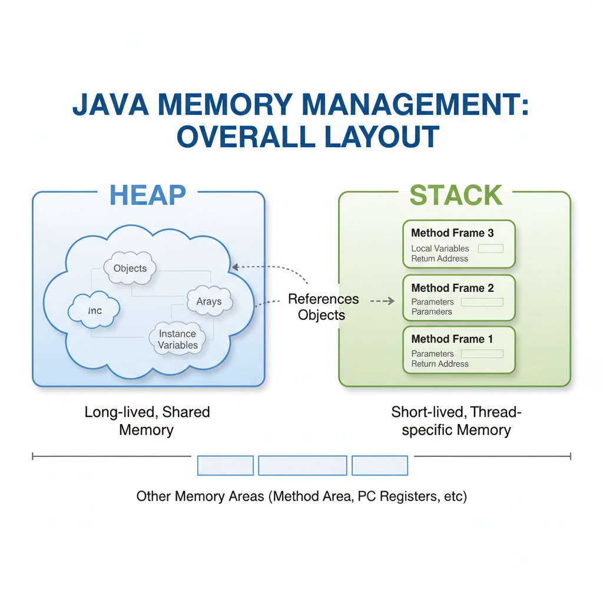

### How Java Manages Memory with Heap and Stack

!!! note annotate ""

    - When a Java program runs, the JVM divides memory into different 
      areas to efficiently store and manage data. 
    - The two main regions are the _Stack_ and the _Heap_.

    - At runtime:
        - [x] The _Stack Memory_ is used for method execution and ==stores local variables==, method calls, and ==references to objects in the heap.==  
        → Each thread in a Java program has its own stack, ensuring thread safety and isolation.  
        → When a method is called, a stack frame is created; when the method ends, the frame is removed, making stack memory fast and automatically managed.
        ---
        - [x] The _Heap Memory_ is used to ==store all objects== and ==class instances created using new==.  
        → The heap is shared among all threads and managed by the _Garbage Collector_, which automatically removes unused objects to free space. 
        → The JVM divides the heap into _Young Generation_, _Old Generation_, and _Permanent Generation_ (Metaspace) 
          to optimize garbage collection and memory allocation.

    - The result: Java ensures efficient memory use by separating short-lived data 
      on the stack and long-lived objects in the heap, all managed automatically 
      through garbage collection and runtime optimization.

      

##### Questions

!!! note annotate "If the interviewer asks, what are the different ways to achieve synchronization in Java?"

    1. Using _synchronized_ keyword on class , on method, on instance block
    2. Use _atomic variable_
    3. Use reentrant lock
    4. Use thread safe collections

    
