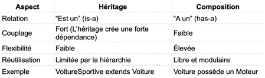
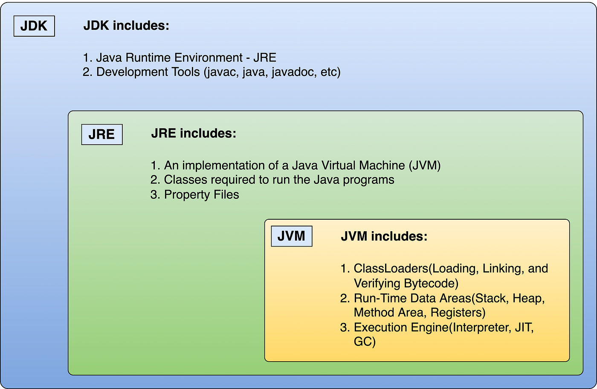

# 

### SOLID

!!! note annotate ""

    **S – Single Responsibility Principle (SRP)**  
    Une classe = une seule responsabilité.
    
    **O – Open/Closed Principle (OCP)**  
    Le code doit être ouvert à l’extension, fermé à la modification.  
    On ajoute de nouvelles fonctionnalités sans casser l’existant.
    
    **L – Liskov Substitution Principle (LSP)**  
    Une classe enfant doit pouvoir remplacer sa classe parent sans altérer le comportement.  
    Garantit la cohérence des héritages.
    
    **I – Interface Segregation Principle (ISP)**  
    Mieux vaut plusieurs petites interfaces spécifiques qu’une énorme interface générique.  
    Réduit les dépendances inutiles.
    
    **D – Dependency Inversion Principle (DIP)**  
    Les classes doivent dépendre d’abstractions, pas d’implémentations concrètes.  
    Facilite les tests et le changement de composants.

    > **Pourquoi c’est clé SOLID en développement web ?**  
    > Dans un projet React, .NET, Node.js ou autre, respecter SOLID permet :
    >
    - d’ajouter de nouvelles features plus rapidement 
    - de réduire les bugs lors des évolutions 
    - de faciliter les tests unitaires et la collaboration en équipe

### Cohésion et Couplage

!!! note annotate ""

    > En POO, on cherche forte cohésion + faible couplage

    - **Cohésion**: Les éléments d’une classe travaillent ensemble sur une seule tâche
        - ^^Le degré de dépendance^^ et de ^^relation logique^^ entre les différentes parties (méthodes, attributs) 
          d’une ^^même classe^^ ou d’un même module.
        - Définit dans quelle mesure les éléments d’une même classe ou d’un même module travaillent ensemble pour accomplir une seule tâche. 
        - Assurer la responsabilité interne
  
    - **Couplage**: Les classes sont indépendantes les unes des autres
          - ^^Le degré de dépendance entre deux classes^^
          - Mesure le degré d’indépendance entre les classes ou modules.
          - Une classe découplée ne dépend pas fortement d’autres classes spécifiques. 
          - Faciliter la maintenance et l’évolution du code

### Composition over Inheritance

!!! note annotate ""

    C’est un principe de conception orientée objet qui recommande de favoriser la composition d’objets plutôt que d’utiliser systématiquement l’héritage entre classes.
    
    **Héritage :** une sous-classe hérite d’une classe mère  
    **Composition :** une classe contient une instance d’une autre classe.
    
    Pourquoi ?
    
    - L’héritage **crée une forte dépendance entre les classes** : Si tu modifies la classe mère, 
        - toutes les sous classes sont affectées 
        - Tu es limité par la hiérarchie (une seule classe mère).
    - La composition, au contraire : **Offre plus de flexibilité** : 
        - tu peux changer le comportement d’un objet en changeant ses composants.
        - Favorise la réutilisation du code sans contrainte hiérarchique

    


### Fonctionnalités de Java
!!! note annotate ""

    Java est un langage de programmation orienté objet qui présente des fonctionnalités telles que l’indépendance vis-à-vis des plateformes, la gestion automatique de la mémoire, la gestion multi-threading, le traitement des exceptions et une sécurité solide.

### Quelle est la différence entre JDK, JRE et JVM

!!! note annotate ""

    - **JDK** - Java Development Kit
        - Utilisé pour développer des applications Java.  
        - +.
            - Le kit de développement Java est l'ensemble des outils dont le développeur a besoin pour développer des logiciels qui peuvent être exécutés par la JVM et le JRE.
            - Il contient le JRE, des API, un compilateur Java et d'autres fichiers requis pour developer d'applications Java.
            - JDK est le composant principal de l'environnent Java et il fournit tous les outils, les exécutables et les binaires requis pour compiler, débogguer et exécuter un programme Java

    - **JRE** - Java Runtime Environment
        - Utilisé pour exécuter des applications Java.
        - Le JRE crée la JVM et s'assure que les dépendances sont disponibles pour les programmes Java.  

    - **JVM** - Java Virtual Machine
        - exécute le bytecode Java dans une couche d’abstraction. 
        - Une application Java ne s'exécute pas directement dans le système d'exploitation mais dans une machine virtuelle qui s'exécute dans le système d'exploitation et propose une couche d'abstraction entre l'application Java et ce système. 
        - La machine virtuelle ne connaît pas le langage Java : elle ne connaît que le bytecode qui est issu de la compilation de codes sources écrits en Java. 
        - La machine virtuelle permet notamment :
            - L'interprétation du bytecode 
            - L'interaction avec le système d’exploitation

    > **`ClassLoader`**: Est une partie du JRE qui charge dynamiquement les classes java et les interfaces dans la machines virtuelle.

    > **`WrapperClass`**: C'est une classe qui fournit un moyen d'utiliser les types de données primitives comme des objets , qui encapsule les types de données primitifs, on a besoin de ces classes pour garder l'objet final et immutable.

      


!!! note annotate ""

    #### **Heap Memory**
    !!! note annotate ""
        - Le HEAP est une partie (portion) de la mémoire utilisé par le JVM pour **stocker les objets créés par l'application**. 
        - Il s'agit d'une partie de mémoire **partagée entre tous les threads**. 
        - Le HEAP est partagé par les threads en cours d'exécutions donc il est partagé par toutes les instances de toutes les classes. 
        - Allocation dynamique du mémoire pour les objets JAVA et les classe JRE au moment de l’exécution. 
        - Les objets sont toujours créé dans l'espace du Tas(Heap) et les références dans la mémoire du pile (Stack)
        - N'est pas Thread Safe :: Mémoire plaine : OutOfMemoryError 
        - **Constant String Pool**:
            - Le Constant String Pool n'est rien d'autre qu'une partie de stockage dans le Heap Memory (tas) où les chaînes de caractères sont stockées. 
            - Il s'agit d'un système similaire à l'allocation d’objets.
    #### **Stack Memory**
    !!! note annotate ""
    
        - La stack est une partie (portion) mémoire qui sert d'espace de **stockage aux variables déclarées par les fonctions**.
        - La stack est aussi appelée la pile en français.
        - La plupart du temps, elle est de taille fixe, déclarée lors du démarrage du thread.
        - Allocation du mémoire statique:
            - Les valeurs primitives d'une méthode
            - **Les références à des objets** qui se trouvent dans le HEAP)(TAS)
        - Est thread-safe car chaque thread fonctionne dans sa propre pile (stack)

### Interface fonctionnelle
!!! note annotate ""

      - Une interface fonctionnelle est une interface qui ne contient qu'une seule méthode abstraite.
        Elle sert de modèle pour une expression lambda ou une référence de méthode.

      - L'interface fonctionnelle a été introduite dans Java 8 qui dispose une unique méthode abstraite.
      Qui peut prendre en charge l'expression lambda
    
    - Mais aussi qui peut prendre en paramètre
        * Une référence vers une methode statique
        * Une référence vers une methode d'instance
        * Une référence vers un constructeur
    - Dans Java 8, 4 interfaces fonctionnelles principales sont introduites :
        * Consumer
        * Predicate
        * Function
        * Supplier

    > La méthode abstraite unique représente une seule unité de calcul, ce qui la rend idéale pour les paradigmes de programmation fonctionnelle.

    !!! note annotate "La programmation fonctionnelle"

        - La programmation fonctionnelle est un style de programmation qui traite le calcul comme 
          l'évaluation de fonctions mathématiques.
        - Elle se concentre sur l'écriture de code de manière
          déclarative et concise, favorisant l'immuabilité et les opérations sans effets secondaires.
          Avec sa prise en charge des interfaces fonctionnelles, Java apporte certains concepts de programmation 
          fonctionnelle tout en conservant sa nature orientée objet.
        ---
        - La programmation fonctionnelle est un paradigme de programmation déclaratif, traitant des opérations successivement 
          en évitant les mutations de données et les changements d'état.
        - Un enchainement d'application de fonctions
        - Un code source conçu en programmation fonctionnelle va être plus concis, plus prédictible et plus facile 
          à tester qu'un code source programmé avec la programmation orientée objet. 
          En revanche, il va paraître plus dense et plus compliqué à comprendre pour les développeurs plus juniors.
        
        - <i>**Par opposition à la programmation orientée objet, l'approche fonctionnelle de la programmation 
          consiste à éviter les mutations de données et les changements d'états**</i>, 
          et les effets de bords dans un code source en se basant sur les principes d'immuabilité 
          et de composition de fonctions.
            - Le code en programmation fonctionnelle n'a aucun état (à part l'état lié aux données initiales).
        
    !!! note annotate "La programmation procédurale"
        
        - Il s'agit d'une séquence d'instructions s'exécutant les unes après les autres
        - https://welovedevs.com/fr/articles/paradigme-programmation-orientee-objet-et-programmation-fonctionnelle/

### Une classe abstraite et une interface
!!! note annotate ""

    - Une classe abstraite peut avoir des méthodes abstraites et non abstraites, alors qu’une interface ne peut avoir que des méthodes abstraites.  
    - Dans une interface les méthodes sont seulement déclarées. Cela permet de définir un ensemble de services visibles depuis l'extérieur (API).  
    - Une classe abstraite peut avoir des variables d’instances alors qu’une interface ne peut avoir que des constantes.

    !!! note annotate "Les classes abstraites"
    
        - Une classe abstraite est <u>une classe dont toutes les méthodes n'ont pas été implémentées</u>. Elle n'est donc pas instanciable, mais sert avant tout à factoriser du code. <u>Une classe qui hérite d'une classe abstraite doit obligatoirement implémenter les méthodes manquantes</u> (qui ont été elles-mêmes déclarées «abstraites» dans la classe parente). <u>Elle n'est pas obligée de réimplémenter les méthodes déjà implémentées dans la classe parente (d'où une maintenance du code plus facile).</u>

    !!! note annotate "Les interfaces"
    
        - Une interface est <u>un peu comme une classe abstraite dans laquelle aucune méthode ne serait implémentée</u> : les méthodes y sont seulement déclarées. 
        - Cela permet de définir un ensemble de services visibles depuis l'extérieur (l'API : Application Programming Interface), 
          sans se préoccuper de la façon dont ces services seront réellement implémentés.
        - Une classe qui implémente une interface doit obligatoirement implémenter chacune des méthodes déclarées dans l'interface, à moins qu'elle ne soit elle-même déclarée… abstraite !

    !!! note annotate "Classe abstraite ou interface ? "
    
        - Classes abtraites et interfaces ont chacune une fonction bien distincte 
            - Les classes abstraites servent à factoriser du code
            - Les interfaces servent à définir des contrats de service.  
        - Pourquoi ne pas utiliser des classes abstraites (dans lesquelles aucune méthode ne serait implémentée) 
            - Dans la plupart des langages actuels (c'est notamment le cas de Java, C#, PHP), 
             il n'est possible pour une classe d'hériter que d'une seule classe parente (abstraite ou non), mais d'implémenter plusieurs interfaces.

### Redéfinition vs surcharge.
!!! note annotate ""

    - On parle de ^^surcharge de méthode^^ lorsqu’une classe possède plusieurs méthodes portant le même nom mais avec des paramètres différents
    - On parle de ^^redéfinition de méthode^^ lorsqu’une sous classe fournit une implémentation spécifique d’une méthode déjà définie dans super-classe.
    ---
    - **Surcharge :** plusieurs méthodes du même nom mais avec des paramètres différents.
    - **Redéfinition :** une sous-classe fournit une implémentation spécifique d’une méthode déjà définie.

### Le mot clé final
!!! note annotate ""

    Utilisé pour :

    - Déclarer une variable constante
    - Une méthode non redéfinissable
    - Une classe non extensible

### La différence entre méthodes statiques et non statiques
!!! note annotate ""

    - ^^Les méthodes statique^^ peuvent être appelées sans avoir besoin d’une instance de classe, 
      alors que ^^les méthodes non statique^^ ne peuvent pas être appelées que sur un objet de la classe.

### Package en Java
!!! note annotate ""

    Un ensemble de classes et d’interfaces apparentées qui constituent un espace de noms pour les classes et les interfaces.

### Collections / List
!!! note annotate ""

    - **ArrayList**: {++Liste basée sur un tableau dynamique++}, contient des elements de meme type, il est permet un accès rapide par index.
    - **Array**: {++ Tableau de taille fixe  ++}, stocke des éléments du même type,il est permet un accès rapide par index.
    - **LinkedList** – {++Liste chaînée++}, chaque élément (noeud)  pointe vers le suivant et le précédent).  insertions et suppressions rapides mais accès par index plus lent.
    - **Vector** : = {++ArrayList synchronisé_ (thread-safe)++}
        - _Liste dynamique basée sur un tableau_, similaire à ArrayList mais synchronisée (thread-safe) 
        - Vector était historiquement utilisé avant Java 2 pour gérer des listes dynamiques thread-safe. 
        - Aujourd’hui, son usage est limité car on préfère **ArrayList + synchronisation explicite**, 
          préférer ArrayList + Collections.synchronizedList() qui rend thread-safe toutes les méthodes de la liste (add(), remove(), get(), etc.). 
        - Chaque opération individuelle est atomique. l’itération est composée de plusieurs opérations internes: (dans les iteration foreach) synchronized(list) est nécessaire
    - **Stack** – {++Sous-classe de Vector++}, utilisée comme ==Pile LIFO== (Last In, First Out)
        - Ancienne classe, aujourd’hui on peut préférer Deque (**ArrayDeque**) pour les piles modernes non synchronisées
    > _Queue et Deque_ sont des interfaces spécialisées pour la gestion des files et piles, tandis que List est une interface pour les collections ordonnées avec accès par index.
    - **Queue** = {++file d’attente FIFO++}: est une structure de données dans laquelle les éléments sont traités selon le principe FIFO – First In, First Out : le premier élément ajouté est le premier à être retiré. 
    - **Deque**: {++file ou liste à double extrémité (LIFO)++} - piles modernes non synchronisées
        - implémentations : ArrayDeque, LinkedList
    - **Map**: _est une **structure clé-valeur_**, il stocke des associations clé-valeur avec des clés uniques.
    - **Set**: _Est une **collection d’éléments uniques qui ne contient pas de doublons_**
    > _HashMap et HashSet_ utilisent le hashCode de l’objet pour stocker et retrouver rapidement les éléments. HashSet repose sur HashMap pour assurer l’unicité des éléments.

    Deux implémentations de `List` :
    
    - `ArrayList` : basé sur un tableau dynamique, accès rapide par index.
    - `LinkedList` : basé sur une liste doublement chaînée, insertions et suppressions rapides.
    
    `Vector` = `ArrayList` synchronisé (thread-safe).  
    `Stack` : sous-classe de `Vector`, utilisée comme pile LIFO (Last In, First Out).
    
    `Queue` et `Deque` : interfaces spécialisées pour files et piles.  
    `Queue` = FIFO (First In, First Out).  
    `Deque` : double extrémité (LIFO/FIFO).
    
    `Map` : structure clé-valeur.  
    `Set` : collection d’éléments uniques.
    
    - Implémentations 
        - `HashMap` : non ordonné
        - `LinkedHashMap` : ordre d’insertion
        - `TreeMap` : trié par clé
        - `HashSet` : aucun ordre garanti
        - `LinkedHashSet` : ordre d’insertion
        - `TreeSet` : trié

### `HashMap` ≠ `Hashtable` :
!!! note annotate ""

    - `HashMap` non thread-safe, autorise `null`.
    - `Hashtable` thread-safe, n’autorise pas `null`.

### Pile (Stack) et File d’attente (Queue)
!!! note annotate ""

    - Une pile **Stack** est une structure de données LIFO (last in, first out)
    - **Queue** est une structure de données FIFO (first in , first out)


### **Immuabilité et thread safety :**  
!!! note annotate ""

    - Un objet **immuable** est un objet dont l’état (les valeurs de ses attributs) ne peut pas être modifié après sa création.
    - Un objet **immuable** ne peut être modifié après création, donc thread-safe.
    - Un objet synchronisé est thread-safe car un seul thread à la fois peut le modifier. 
    - Il s'agit d'objets, qui une fois initialisés, ne peuvent plus être modifiés 
        - L'intérêt est notamment d'avoir des objets qui sont par définition thread-safe qui permet d'éviter d'avoir des blocs synchronized autour de ces objets.
        - Ce qui nous assure de ne pas avoir à nous soucier de problèmes de concurrence. De plus, qui dit objets immuables, dit des objets simples à créer, à utiliser et à tester. 
    - **Un objet est synchronisé** === Thread-safe ce qui signifie qu'il peut être utilisé de manière sûre dans des environnements multi-thread. 
    - **Un objet est synchronisé** === Thread-safe c'est-à-dire que dans un environnement multi-threading, il maintient les autres threads dans un état exécutable ou non exécutable jusqu'à ce que le thread actuel libère le verrou de l’objet.

### String vs StringBuilder vs StringBuffer
!!! note annotate ""

    - ^^String est immuable^^, la concaténation de deux objets string implique la création d'un nouvel objet.
    - _String_  implémente l'interface Comparable
    - _StringBuilder_ est rapide et consomme moins de mémoire qu'une `String` lors des concaténations. 
    --- 
    - **String** : immuable, thread-safe
    - **StringBuilder** : mutable, non thread-safe
    - **StringBuffer** : mutable, thread-safe

### Optional
!!! note annotate "Optional"

    - Qui permet d'encapsuler un objet dont la valeur peut être null.

### equals vs ==
!!! note annotate ""

    - `equels` est utilisé **pour comparer les valeurs de deux objets**, `l’opérateur ==` est utilisé **pour comparer les références (les adresses mémoire)** de deux objets
    - `==`: Utilisé pour les types primitifs (int, boolean, etc.) et les références d’objet. 
        - Compare les références mémoire (l’adresse des objets). 
        - Vérifie si les deux variables pointent vers le même objet.
    - `equals()`: compare les valeurs.

### Garbage Collector
!!! note annotate ""

    Libère automatiquement la mémoire en supprimant les objets dont le programme n’a plus besoin.

### Modificateurs d’accès
!!! note annotate ""

    - **public** : accessible partout
        - permet d’accéder à une méthode ou variable de partout
    - **private** : accessible uniquement dans la classe
        - restreint l’accès à une méthode ou à une variable à l’intérieur de la classe
    - **protected** : accessible dans la classe et ses sous-classes
        - permet l’accès à une méthode ou à une variable à l’intérieur de la classe et de ses sous-classes.

### Bloc try-catch
!!! note annotate ""

    Utilisé pour la gestion des exceptions :  
    `try` contient le code à risque, `catch` gère l’exception.

### Méthode abstraite
!!! note annotate ""

    Méthode sans implémentation, définie dans une classe abstraite ou une interface, à implémenter dans la sous-classe.

### Bloc statique
!!! note annotate ""

    Bloc de code exécuté lors du chargement de la classe en mémoire.

### Exceptions (checked/unchecked)
!!! note annotate ""

      - Les exceptions **checked** **sont vérifiées à la compilation** et doivent être gérées par le programmeur
      - Les exceptions **unchecked** **ne sont pas vérifiées à la compilation** et n’ont pas besoin d’êtres gérées.

### Expression lambda
!!! note annotate ""

    - Est une nouvelle fonctionnalité de java qui permet de créer des fonction anonymes, il simplifie le syntaxe de la programmation fonctionnelle en J
    - Est une implémentation d’une interface fonctionnelle

### volatile
!!! note annotate ""

    - S’applique uniquement aux variables.
    - Utilisé pour partager une variable entre threads.
    - Pour assurer la sécurité en multi-thread au niveau des méthodes, on utilise **synchronized** ou d’autres mécanismes de concurrence (locks, Atomic*, etc.).
    - volatile  pour variables partagées entre threads.
    - synchronized pour méthodes ou blocs critiques.

!!! note annotate "Pourquoi la méthode main est-elle statique en Java ?"

    - La JVM appelle la méthode `main()` en se basant sur le nom de la classe elle-même. Pas en créant l’objet.

!!! note annotate "La méthode principale main() peut-elle être surchargée ?"

    - Oui, il est possible de surcharger la méthode `main()`,
      mais seule la version standard sera utilisée comme point d’entrée du programme.
      `public static void main(string[] args)`

!!! note annotate "var d instance et var locale"

    - ^^Variables d’instance^^
        - Les variables d’instance sont des variables qui sont accessibles par toutes les méthodes de la classe. 
        - Elles sont déclarées en dehors des méthodes et à l’intérieur de la classe. 
        - Ces variables décrivent les propriétés d’un objet et restent liées à celui-ci
    - ^^Variables locales^^
        - Les variables locales sont des variables présentes dans un bloc, 
          une fonction ou un constructeur et ne sont accessibles qu’à l’intérieur de ceux-ci.
        - L’utilisation de la variable est limitée à la portée du bloc

!!! note annotate "lombok"

    - La librairie lombok permet :
        - d'utiliser des annotations au lieu de coder
        - d'éviter le codage de setters, getters, contructors, builders, equals, hashcode …

!!! note annotate "CDI"

    - Une spécification destinée à standardiser ^^l'injection de dépendances et de contextes^^

!!! note annotate "Tests unitaires"

    - Éviter les regressions
       - Valider le fonctionnement
       - Documenter

!!! note annotate "Spring-batch est un module pour faire des traitements batch"

    - Permet de lire des données, les traiter et les sauvegarder
      JSR 222 (JAXB)

!!! note annotate "Parlez-nous du compilateur JIT."

    - ^^JIT^^ est l’abréviation de Just-In-Time et est utilisé pour améliorer les performances pendant l’exécution.
    - Le compilateur n’est rien d’autre qu’un traducteur du code source en code exécutable par la machine.
       - Tout d’abord, la conversion du ==code source Java (.java)== en ==byte code (.class)== se fait à l’aide du compilateur `javac`.
       - Ensuite, les fichiers `.class` sont chargés ^^au moment de l’exécution^^ par la `JVM` et à l’aide d’un interpréteur, 
         ils sont convertis en code compréhensible par la machine.
       - Le ^^compilateur JIT^^ fait partie de la JVM. Lorsque le compilateur JIT est activé, 
         la JVM analyse les appels de méthode dans les fichiers `.class` et les compile 
         pour obtenir un code natif plus efficace. <br/>
         Il s’assure également que les appels de méthode prioritaires sont optimisés.
       - Une fois l’étape ci-dessus effectuée, la JVM exécute directement le code optimisé 
         au lieu de réinterpréter le code. Cela augmente les performances et la vitesse d’exécution.

### Thread en Java
!!! note annotate ""

    Un thread est un processus léger qui s’exécute indépendamment du flux principal.  
    **Mot clé synchronized :** assure qu’un seul thread accède à un bloc de code à la fois.

### ThreadLocal
!!! note annotate ""

    - Problème: comment stocker des données qui doivent être différentes pour chaque thread 
           sans conflits ni synchronisation complexe.
    - Solution : ThreadLocal

    ---

    - `ThreadLocal` est une classe ^^qui permet de stocker des données spécifiques à un thread.^^
        - `ThreadLocal` permet de stocker une valeur différente pour chaque thread, sans partager avec les autres threads
        - Chaque thread a sa propre copie indépendante des autres threads.
        - `ThreadLocal` crée une copie par thread, donc chaque thread lit/écrit sa propre valeur.
    - `ThreadLocal` n’est pas une variable globale partagée.
        - ThreadLocal ne rend pas la variable thread-safe pour un partage global : elle n’est thread-safe que par thread.
        - Solution correcte pour partage global => AtomicInteger, synchronized, ConcurrentHashMap ...
    - Utilité : 
        - Éviter le partage de données entre threads et simplifier le passage de variables dans les appels de méthodes.
        - Pour stocker des données spécifiques à un thread


### Perf : STAR
!!! note annotate "Perf : STAR"

    - Situation:
        - Nous devions traiter des fichiers XML très volumineux conformes à la norme IEC 61850.
        - Le traitement via l’API Java `JAXB` pour convertir ces fichiers en objets Java et inversement était très lent, 
          ce qui affectait la réactivité de l’application pour les utilisateurs

    - Tâche:
        - Ma tâche était de diagnostiquer le problème de performance, proposer et tester des solutions afin d’améliorer le débit et la réactivité 
          de l’application lors de l’import et de la conversion des fichiers XML.

    - Action:
        - J’ai commencé par analyser l’utilisation de la mémoire et le temps de traitement 
          à l’aide de Spring Actuator et des outils de monitoring JVM afin d’identifier les points critiques de performance
            - les points critiques, afin d’identifier les parties du code qui consommaient 
              le plus de mémoire et prenaient le plus de temps à s’exécuter 
              (notamment la conversion complète des fichiers XML en objets Java).
        - Ensuite, j’ai mené plusieurs proofs-of-concept (POC) :
            - J’ai testé l’API JAXB en utilisant le chargement par blocs avec `StAX`, 
                au lieu de charger le fichier XML complet en mémoire.

    - Résultat:
        - Grâce à ces actions:

            - Le débit de traitement des fichiers XML a été significativement augmenté,
                et l'app est devenue beaucoup plus réactive.
            - La mémoire consommée a diminué de 40 %
            
                > Le passage du stockage de la base de données vers un NAS a allégé la charge sur la base, amélioré le stockage
                > 
                > Un NAS est un système de stockage connecté au réseau, 
                qui permet de stocker et partager des fichiers entre plusieurs machines.

### Java news
!!! note annotate ""

    [https://www.neosoft.fr/nos-publications/blog-tech/java-8-whats-new-23-date-and-time/](https://www.neosoft.fr/nos-publications/blog-tech/java-8-whats-new-23-date-and-time/)
    #### Java8:

       * [x] Streams: L'API Stream et Collector
       * [x] Les expressions lambda
       * [x] La programmation fonctionnelle (Interface fonctionnelle) => foreach, filter, map, reduce ...
       * [x] Api Date & Time
       * [x] La classe Optional

    !!! note annotate ""

           - L'apport technique majeur de l'API *Date* de Java 8 => ^^des classes immutables^^
           - Les principes architecturaux autour desquels a été conçu la nouvelle API Date sous les suivants :
              - **Immuabilité et thread safety** : Toutes les classes centrales de l'API Date and Time sont immuables, ce qui nous assure de ne pas avoir à nous soucier de problèmes de concurrence. De plus, *qui dit objets immuables, dit des objets simples à créer, à utiliser et à tester.*
              - **Chaînage** : <i>**les méthodes chaînables rendent le code plus lisible**</i> et elles sont aussi plus simples à apprendre. Quant aux méthodes de type factory (par exemple: now(), from(), etc.) elles sont utilisées en lieu et place de constructeurs.
              - Clareté : Chaque méthode définie clairement ce qu'elle fait. De plus, hormis dans quelques cas particuliers, passer un paramètre nul à une méthode provoquera la levée d'un NullPointerException. Les méthodes de validation prenant des objets en paramètre et retournant un booléen retournent généralement "false" lorsque null est passé.
              - Extensibilité : Le design pattern Stratégie utilisé à travers l'API permet son extension en évitant toute confusion. Par exemple, bien que les classes de l' API soient basées sur le système de calendrier ISO-8601, nous pouvons aussi utiliser les calendriers non-ISO – tel que le calendrier Impérial Japonais – qui sont inclus dans l'API, ou même créer votre propre calendrier.
    
    #### Java 9
       * [x] Modules, var
       * [x] API et outils: des fabriques (factory pour des collections immutables: List.of(), Set.of(), Map.of().
    
    #### Java 11
       * [x] JDK 11 embarque un certain nombre de nouvelles classeset méthodes intégrées à des modules déjà existants:
        ```java
        ###### java.lang.String :
        boolean isBlank(): retourne true si le String est vide ou n'est composé que de whitespaces, sinon false.
        Stream lines(): retourne un stream des lignes extraites du String.
    
        ###### New File Methods
        We can use the new *readString* and *writeString* static methods from the Files class:
        Path filePath = Files.writeString
        String fileContent = Files.readString(filePath);
    
        ###### (var keyword) in lambda parameters was added in Java 11.
        ```
    
       * [x] The new HTTP client from the java\.net\.http package was introduced in Java 9\. It has now become a standard feature in Java 11\.
    
    
       * [x] Running Java Files
          - A major change in this version is that we don't need to compile the Java source files with javac explicitly anymore:
    
         ```java
         $ javac HelloWorld.java
         $ java HelloWorld 
         Hello Java 8!
         ### new
         $ java HelloWorld.java
         Hello Java 11!
         ```
    
    #### Java 17 
 
      * [x] {++Type (classes) Record++} (Introduits en Java 16 (finalisés dans Java 17) )
         - Un record permet de créer facilement des objets immutables
         - Simplifient la création de classes immuables et de DTO.
         - Une "record class”" = un type spécial de classe conçu pour contenir des données immuables avec moins de code

      * [x] {++Pattern matching++} Extraire directement des valeurs typées sans cast explicite,
         - Cette fonctionnalité concerne le mot-clé ^^instanceof^^, qui permet de vérifier le type d'un objet.
         - Avec la nouvelle syntaxe, l'objet est créé ^^au moment de l'appel à instanceof^^ ==(Plus besoin de cast manuel)==
           et il est possible de faire directement appel à ses propriétés par la suite, sans avoir à passer par un objet temporaire.

      * [x] {++Nouveau Switch++}
         - Il est possible de retourner une valeur grâce à un switch, pas besoin de `break`

      * [x] {++G1 + ZGC++} améliorés
         - `G1` ^^est devenu plus stable^^ ==avec une meilleure gestion des pauses==, il garde des pauses courtes.
         - `ZGC` ==minimise les pauses même sur de très grandes piles mémoire==
         > ```java java -XX:+UseG1GC -jar app.jar ```
         > 
         > ```java java -XX:+UseZGC -jar app.jar ```

         - Java propose plusieurs garbage collectors pour s’adapter à différents besoins :
            - G1 est conçu pour ^^un équilibre entre performance et pauses courtes^^
            - ZGC garbage collector concurrent, éviter que l’application 
              s’arrête longtemps pour le GC, même si elle utilise beaucoup de mémoire,
              il peut gérer des heaps très grands

      * [x] Sealed classes (Présentes dès Java 17 (finalisées en 21).)
         - Permettent de restreindre quelles classes peuvent hériter d’une classe mère
        
      * [x] Blocs de texte
         - Il est possible de créer des blocs de texte de façon simple.
        

    #### Java 21
    
      - [x] {++Record Pattern++} (JEP 440)
         - Lire / extraire les données d’un record (Une syntaxe de déstructuration)
         - Précédemment (Java 19) en phase de preview, cette fonctionnalité est désormais officielle
         - ^^Utilise le Pattern matching (instanceof / switch)^^

      - [x] {++Pattern matching++} 
         - Étendu aux switch
         - Le switch est entièrement modernisé, il gère les types, les patterns,
           les guards ^^when^^, les valeurs null, et les record patterns.
            - les guards ^^when^^ on peut ajouter une condition (guard clause)

      - [x] {++Threads Virtuels++}
         - Les `threads Java` étaient liés à **un thread système** → lourds et coûteux à créer
         - Avec `Virtual Threads`, Java crée des milliers (voire millions) de threads légers **gérés par la JVM**
         - Un `Virtual Threads` est un thread léger **géré par la JVM**, beaucoup plus léger qu’un thread classique.
            - Un thread classique est un fil d’exécution lourd **géré par le système d’exploitation**, 
              limité en nombre. 

         - Virtual Threads utilisent une pile beaucoup plus petite 
           et la ^^JVM partage l’exécution de plusieurs virtual threads sur les threads OS disponibles.^^

            > Exemple
            >
            > Imagine un `thread OS comme un serveur` et les `virtual threads comme des clients` :
            > 
            > Le `serveur` peut servir des milliers de `clients` en partageant son temps de manière efficace.
         
         - Depuis sa version 19, Java a introduit le projet Loom, et avec lui, la promesse d'une ^^programmation asynchrone non bloquante^^, tout en restant dans un paradigme impératif.
         - Contrairement au ^^Thread Plateforme^^ qui est ^^associé à un unique Thread de l'OS^^ 
           ==Un Thread Virtuel== ^^n'est associé à aucun Thread^^. <br/> 
           Au moment de son exécution, la **JVM** va choisir un Thread porteur ^^Carrier Thread^^ et y affecter le Runnable.<br/> 
           Lorsque le code fait une opération bloquante, il va être détaché du Thread porteur (Yield) et son état va être stocké en RAM.<br/> 
           Le thread porteur est alors libre d'exécuter le code d'un autre Thread virtuel (via une Continuation).

        - Link: [https://www.sfeir.dev/back/revolutionnez-votre-programmation-asynchrone-avec-java-21-et-loom/](https://www.sfeir.dev/back/revolutionnez-votre-programmation-asynchrone-avec-java-21-et-loom/)

      * [x] {++G1 et ZGC++} encore plus performants (moins de pause, plus de stabilité)
