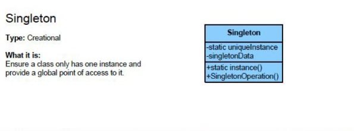
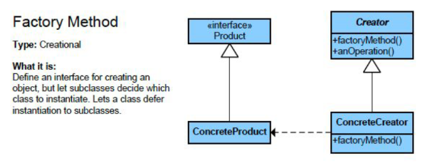
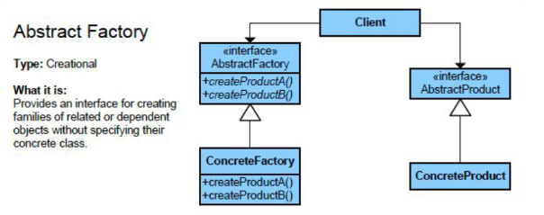
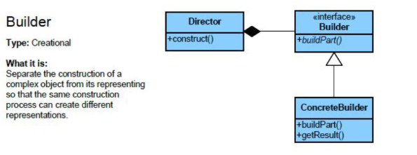
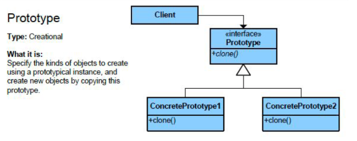

#### Singleton
!!! note annotate "Singleton"

	- Ensures that a class has only one instance and provides a global point of access to that instance.
    - Useful for managing shared resources or configurations.

    

#### Factory Method
!!! note annotate "Factory"

	- Factory Defines an interface for creating an object, but lets subclasses decide which class to instantiate.
    - It centralizes object creation while allowing flexibility for different product types.

    

#### Abstract Factory
!!! note annotate "Abstract Factory"

    - Abstract Factory Provides an interface for creating families of related or dependent objects without specifying their concrete classes. It’s a “factory of factories.”

    

#### Builder
!!! note annotate "Builder" 

	-Builder Separates the construction of a complex object from its representation, allowing the same construction process to create different representations. Ideal for objects with many optional parameters.

    
    ```java
    StringBuilder
    ```

#### Prototype
!!! note annotate "Prototype"

	-Prototype Creates new objects by copying an existing object (the prototype) instead of creating new instances from scratch. This is often more efficient for complex object creation.

    
    ```java
    obj.clone(), Date#clone(), ArrayList#clone()
    ```

#### Template
!!! note annotate "Template"

    - 

#### Observer
!!! note annotate "Observer"

    - 

#### Visitor
!!! note annotate "Visitor"

    - 

#### Facade
!!! note annotate "Facade"

    - 

#### Composite
!!! note annotate "Composite"

    - 

