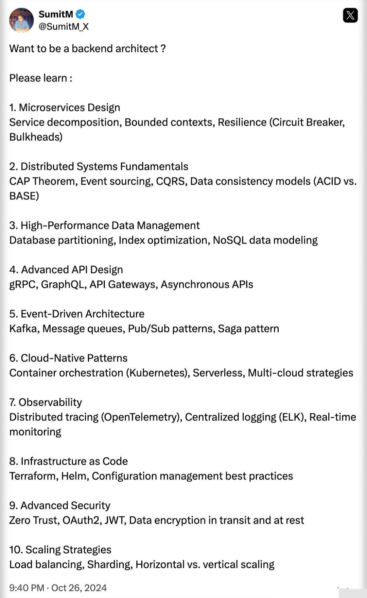

1. Creational Patterns

    - [x] `Singleton` : Ensure a single global instance
    - [x] `Factory` Method: Creates Objects without specifying classes
    - [x] `Builder`: Construct complex objects step-by-step

2. Structural Patterns

    - [x] `Adapter`: ==Connects incompatible interfaces==
         - The Adapter pattern allows objects with incompatible interfaces 
           to collaborate by creating an intermediate class, known as the Adapter, 
           that translates one interface into another.
         - The Adapter pattern wraps an existing object to make its interface compatible with what the client expects.
         - _Key Components of the Decorator Design Pattern_
             - Target Interface: The interface expected by the client
             - Adaptee: The existing class with an incompatible interface that needs integration.
             - Adapter: Implements the target interface and uses the adaptee internally, acting as a bridge.
             - Client: Uses the target interface
         - _Different implementations of Adapter Design Pattern_
            - Class Adapter (Inheritance-based)
            - Object Adapter (Composition-based)
            - Two-way Adapter
         - Example: 
             - [https://dev.to/syridit118/understanding-the-adapter-design-pattern-4nle](https://dev.to/syridit118/understanding-the-adapter-design-pattern-4nle)
             - [https://www.geeksforgeeks.org/system-design/adapter-pattern/](https://www.geeksforgeeks.org/system-design/adapter-pattern/)
    - [x] `Decorator`: ==Adds new functionality to an object==
        - _Key Components of the Decorator Design Pattern_
            - Component Interface
            - Concrete Component
            - Decorator: Abstract class wrapper
            - Concrete Decorator
         - _Key Features:_
            - Open-Closed Principle (OCP): Extend object behavior without altering existing code. 
            - Composition over Inheritance: Combine multiple behaviors without creating a rigid class hierarchy.
         - Example:
            - [https://www.geeksforgeeks.org/system-design/decorator-pattern/](https://www.geeksforgeeks.org/system-design/decorator-pattern/)
    - [x] `Facade Method`: Simplifies complex subsystems
        - ==Provides a simplified interface to a complex subsystem==
        - It delegate client requests to appropriate subsystem objects.
        - _Key Features:_
            - Reduced Coupling: Minimizes client dependency on system internals
            - Encapsulation
        - Example [https://www.geeksforgeeks.org/system-design/facade-design-pattern-introduction/](https://www.geeksforgeeks.org/system-design/facade-design-pattern-introduction/)

  - More: [https://dev.to/syridit118/understanding-the-adapter-design-pattern-4nle](https://dev.to/syridit118/understanding-the-adapter-design-pattern-4nle)

---

- [x] Adapter vs Decorator: What it does:
    - **Adapter** Wraps objects to convert its interface.
    - **Decorator** Wraps objects to add new functionalities or behaviors
    ---
    - **Adapter** Changes the interface of an object to make it compatible with another.
    - **Decorator** Adds new functionality to an object without changing its interface.

---

3. Behavioral Patterns

    - [x] `Strategy`: Define a family of algorithms and make them interchangeable
        - The Strategy pattern is about selecting the appropriate behavior (or strategy) at runtime. 
        - _Key Components of the Strategy Design Pattern_
            - An abstract class or interface known as the Strategy Interface
                - it guarantees that all strategies follow the same set of rules
            - Concrete Strategies are the various implementations of the Strategy Interface
     - [x] `Observer`:
        - Enables objects to subscribe to and receive updates from another object at runtime.  
        - _Key Components of the Observer Design Pattern_
            - Subject Interface
            - Observer Interface
            - ConcreteSubject: Implements the subject interface, A specific subject that holds actual data
            - ConcreteObserver: Implements the observer interface and subscribe to subject updates
    - [x] `Command`

#### Singleton
!!! note annotate "Singleton"

	- Ensures that a class has only one instance and provides a global point of access to that instance.
    - Useful for managing shared resources or configurations.

    

#### Factory Method
!!! note annotate "Factory"

	- Factory Defines an interface for creating an object, but lets subclasses decide which class to instantiate.
    - It centralizes object creation while allowing flexibility for different product types.

    

#### Abstract Factory
!!! note annotate "Abstract Factory"

    - Abstract Factory Provides an interface for creating families of related or dependent objects without specifying their concrete classes. It’s a “factory of factories.”

    

#### Builder
!!! note annotate "Builder" 

	-Builder Separates the construction of a complex object from its representation, allowing the same construction process to create different representations. Ideal for objects with many optional parameters.

    
    ```java
    StringBuilder
    ```

#### Prototype
!!! note annotate "Prototype"

	-Prototype Creates new objects by copying an existing object (the prototype) instead of creating new instances from scratch. This is often more efficient for complex object creation.

    
    ```java
    obj.clone(), Date#clone(), ArrayList#clone()
    ```

[//]: # (#### Proxy)

[//]: # (!!! note annotate "Proxy")

[//]: # ()
[//]: # (#### Template)

[//]: # (!!! note annotate "Template")

[//]: # ()
[//]: # (#### Observer)

[//]: # (!!! note annotate "Observer")

[//]: # ()
[//]: # (#### Visitor)

[//]: # (!!! note annotate "Visitor")

[//]: # ()
[//]: # (#### Facade)

[//]: # (!!! note annotate "Facade")

[//]: # ()
[//]: # (#### Composite)

[//]: # (!!! note annotate "Composite")

---

[//]: # (---)

[//]: # (> Design pattern)

[//]: # (![img.png]&#40;https://pbs.twimg.com/media/G4V9M08WEAAMDjr?format=jpg&name=large&#41;)


As a Backend dev , how many concepts can you explain from below :

1. Event-Driven Architecture

2. Saga Pattern

3. CQRS (Command Query Responsibility Segregation) 

4. Event Sourcing

5. Circuit Breaker Pattern

6. Distributed Tracing

7. CAP Theorem

8. Idempotency

9. Data Sharding

10. API Gateway


#### CQRS (Command Query Responsibility Segregation)
!!! note annotate "CQRS (Command Query Responsibility Segregation)"

    - Idea: Split your system into two parts:
        - [x] Command side :  handles writes (insert, update, delete). 
        - [x] Query side :  handles reads (fetching data). 
        - This avoids a single model being overloaded with both responsibilities. 
        - Example: E-commerce Order System

    - `Traditional way`:
        - You have an OrderService with methods:
        ```java
        createOrder()
        updateOrderStatus()
        getOrdersByUserId()
        ```
        - One service, one database, one model : simple but becomes complex when scale grows.

    - `CQRS way`:
        - **Command side**:
            - OrderCommandService: responsible for writes. 
            - Stores orders into the Order DB (write-optimized).
        - **Query side**:
            - OrderQueryService :  responsible for reads. 
            - Fetches orders from a Reporting DB (read-optimized, maybe NoSQL or cache).

    - `Data Sync`:
        - When a new order is created, the command side publishes an event (e.g., OrderCreatedEvent).
        - A consumer updates the read DB with the new order.

    - `Benefits`:
        - Reads can be scaled separately from writes. 
        - Read side can be optimized (caching, denormalization). 
        - Fits naturally with Event-Driven systems.

---




